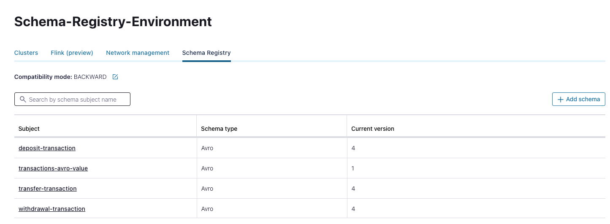
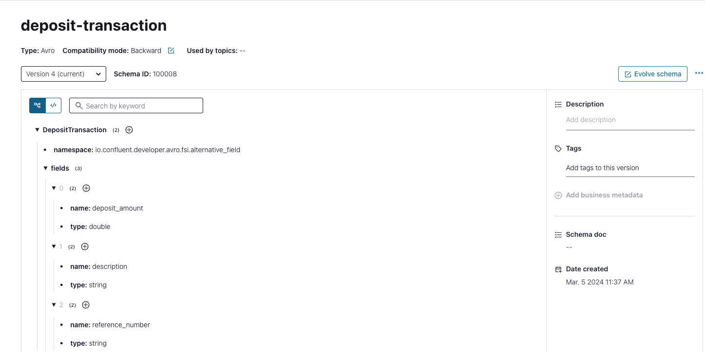
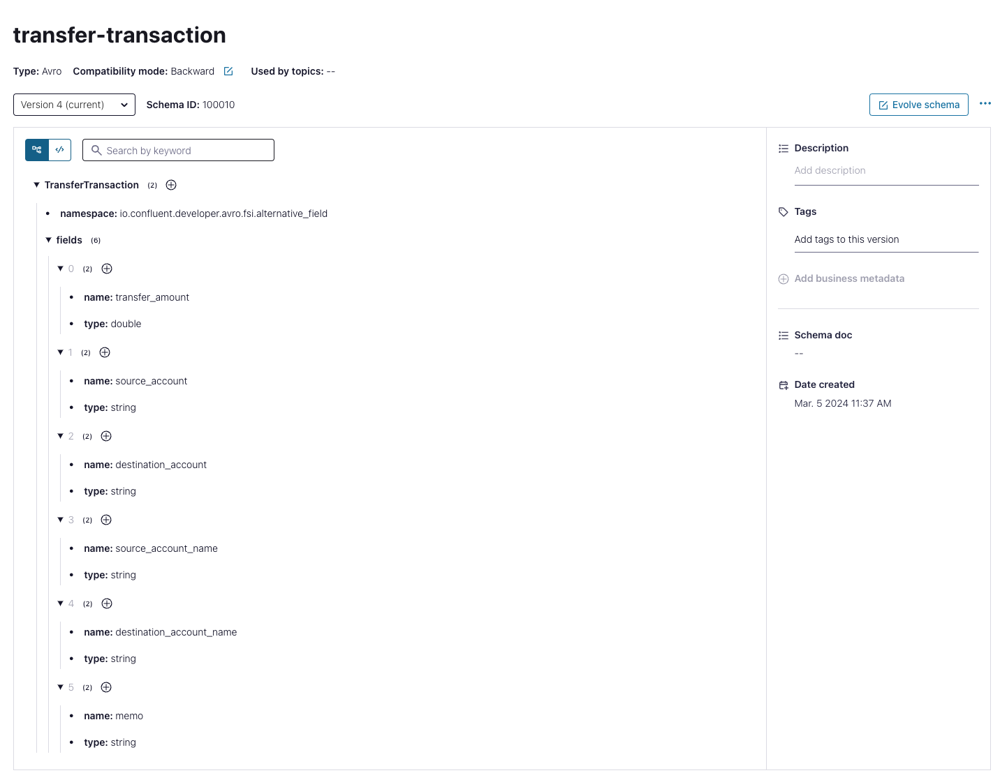
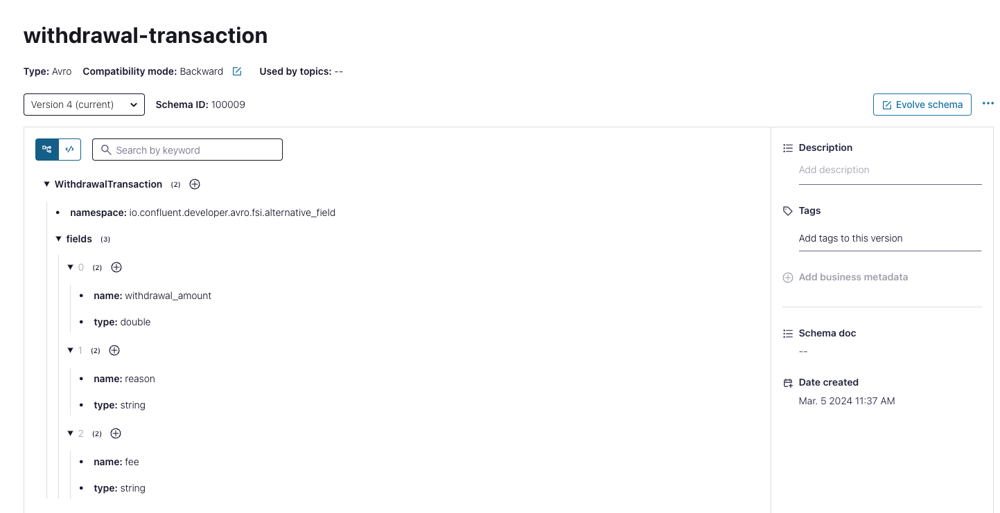

# Avro Alternative Field Example
This is an example where you read Avro schema from the local file system and register it on the target Schema Registry server.
This approach can be used in a continuous deployment pipeline to push schemas to a new environment.
This example contains an FSI transaction record example with an alternative field attribute.

## System requirements
In order to execute the example implemented in this repository be sure to have created the Confluent environment
running the script _create_environment.sh_ provided into the root project _build-environment_.

In case you already have a Confluent Cloud cluster please set the values of the following variable in the _pom.xml_ file:

- _${endpoint_url}_
- _${api_key}_
- _${api_secret}_

## Run the example
To run the example register the Avro schemas, the main one, related to Financial Transaction, and the others
related to "union" transaction_details field, into the Schema registry executing the command:

```
$  mvn compile schema-registry:register  
```



You can also inspect the structure of the two schemas clicking on the subject name:








Now you can execute the unit test implemented into the FinancialTransactionTest class that will produce and consume an event,
following the schema implemented and registered before, verifying that the event adheres to the schema.
Do it executing the command:
```
$  mvn test  
```

## Destroy environment
In order to contain your cost you should remove all the built resources at the end of your test.

You can easily do it running the script _destroy_environment.sh_ provided into the root project _build-environment_.

In this way all the resources created previously will be removed from Confluent Cloud