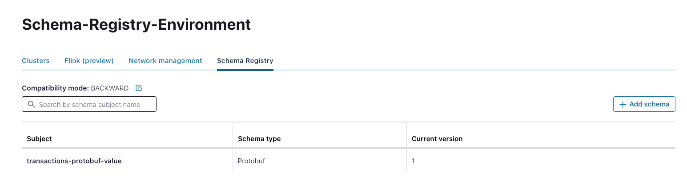

# Protobuf Rest-API schema registration
This is an example where you read Protobuf schema from the local file system and register them on the target Schema Registry server using Rest API

## System requirements
In order to execute the example implemented in this repository be sure to have created the Confluent environment 
running the script _create_environment.sh_ provided into the root project _build-environment_.

In case you already have a Confluent Cloud cluster please set the values of the following variable in the _pom.xml_ file:

 - _${endpoint_url}_ 
 - _${api_key}_
 - _${api_secret}_

## Run the example
To run the example, registering the Protobuf schema into the Schema registry, execute the file rest-api-protobuf-registration.sh:

```
$ cd src/main/resources
$ ./rest-api-protobuf-registration.sh.sh  
```
This executable file contains che invocation of the API needed to register the schema into Confluent Cloud Schema Registry.

You are now able to see the schema into the schemas list



You can also inspect the structure of the schema clicking on the subject name:


## Destroy environment
In order to contain your cost you should remove all the built resources at the end of your test.

You can easily do it running the script _destroy_environment.sh_ provided into the root project _build-environment_.

In this way all the resources created previously will be removed from Confluent Cloud