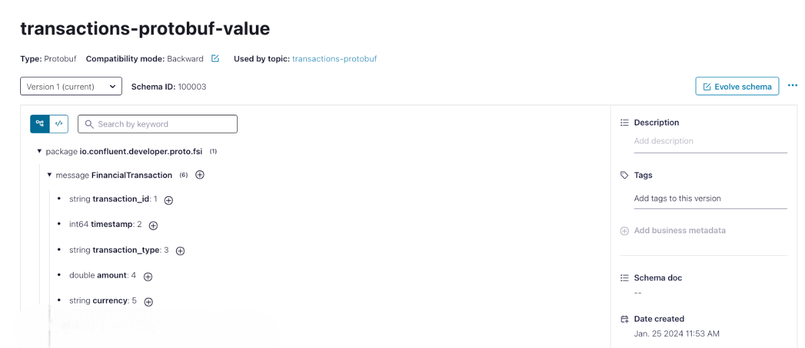

# Protobuf simple schema registration
This is an example where you read Protobuf schema from the local file system and register them on the target Schema Registry server.
This approach can be used in a continuous deployment pipeline to push schemas to a new environment.

## System requirements
In order to execute the example implemented in this repository be sure to have created the Confluent environment
running the script _create_environment.sh_ provided into the root project _build-environment_.

In case you already have a Confluent Cloud cluster please set the values of the following variable in the _pom.xml_ file:

- _${endpoint_url}_
- _${api_key}_
- _${api_secret}_

## Run the example
To run the example, registering the Protobuf schema into the Schema registry launch the command:

```
$  mvn compile schema-registry:register  
```
The maven plugin will register the FinancialTransaction.proto into the Schema Registry.


You can also inspect the structure of the schema clicking on the subject name:



## Destroy environment
In order to contain your cost you should remove all the built resources at the end of your test.
You can easily do it running the command:

```
$ cd ../../build-environment/src/main/resources/
$ ./destroy_environment.sh 
```
In this way all the resources created previously will be removed from Confluent Cloud